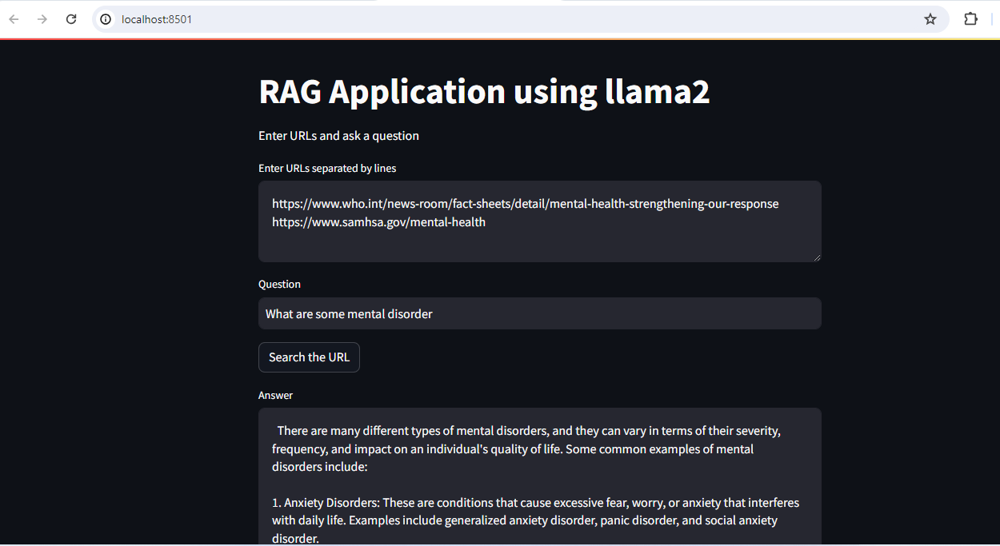

# rag-application-llama2

This is a RAG application using llama2 which is built on langchain. It does the followings: 

1. Users enters the URL(s) 
2. Users asks a question 
3. The application returns the answer from the provided URL(s)

# Install

1. pip install streamlit
2. pip install langchain

# Run ollama server

Before running the code, run the following:

ollama run(llama2) 

P.S. I have used llama2. You can replace according to the LLM you use. Please make sure to pull the model before running.

# Run the code

streamlit run chat.py

# Output

